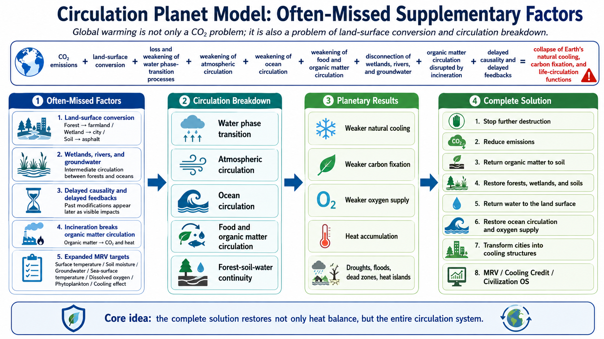

# Circulation Planet Model: Often-Missed Supplementary Factors

## Land-surface conversion, wetlands/rivers/groundwater, delayed causality, incineration, and expanded MRV targets

[日本語](CIRCULATION_PLANET_MISSING_FACTORS_ja.md) | [English](CIRCULATION_PLANET_MISSING_FACTORS.md) | [العربية](CIRCULATION_PLANET_MISSING_FACTORS_ar.md)

Top pages: [README_ja.md](README_ja.md) | [README.md](README.md) | [README_ar.md](README_ar.md)

Related documents: [Circulation Completeness Addendum](CIRCULATION_COMPLETENESS_ADDENDUM.md) | [Limitation of a CO₂-Only Climate Diagnosis](CO2_ONLY_DIAGNOSIS_LIMITATION.md) | [Historical Causal Chain](HISTORICAL_CAUSAL_CHAIN.md)

## Diagram



---

## Overview

This document supplements Master’s definition of global warming causality and the complete solution by framing it as a Circulation Planet Model.

The existing definition integrates CO₂, the loss and weakening of natural phenomena, water phase-transition processes, atmospheric circulation, ocean circulation, and food/organic matter circulation.

However, a complete definition should also explicitly include the following often-missed factors:

```text
1. Land-surface conversion
2. Wetlands, rivers, and groundwater
3. Delayed causality and delayed feedbacks
4. Organic matter circulation disrupted by incineration
5. Expanded measurement targets
```

---

## 1. Land-surface conversion: from natural surface to artificial surface

Global warming is not only an atmospheric issue. It is also a transformation of land-surface functions.

Forests, grasslands, wetlands, soils, rivers, and coastal zones originally supported water retention, evapotranspiration, carbon fixation, heat buffering, microbial circulation, and ecological circulation.

Humanity has converted them into farmland, cities, roads, asphalt surfaces, concrete waterways, monoculture forests, and industrial zones.

```text
Forest → farmland
Grassland → farmland
Wetland → city
Soil → asphalt
River → concrete channel
Natural forest → monoculture
Organic matter circulation → incineration and disposal
```

This land-surface conversion changes water retention, evapotranspiration, heat capacity, reflectivity, carbon fixation, and microbial diversity.

Therefore, global warming is not only a sky problem. It is also the loss of natural cooling functions caused by the artificialization of land-surface functions.

---

## 2. Wetlands, rivers, and groundwater: the intermediate circulation between forests and oceans

A complete water-cycle definition cannot include only forests and oceans.

Between them are wetlands, rivers, lakes, groundwater, floodplains, and coastal zones.

Wetlands are intermediary systems that support carbon fixation, water purification, water retention, flood mitigation, evaporation, evapotranspiration, and biodiversity.

Rivers transport water, organic matter, nutrients, sediments, and living flows from mountains to the ocean.

Groundwater is a delayed water-cycle system. Rain enters the ground and returns to springs, rivers, and the ocean over long periods.

If these systems are lost, forests and oceans become disconnected.

Therefore, a complete solution must restore a continuous water cycle connecting forests, soils, wetlands, rivers, groundwater, coastal zones, oceans, and the atmosphere.

---

## 3. Delayed causality and delayed feedbacks

There is a major time lag between causes and visible results in global warming.

Forests are removed. Soil microorganisms weaken. Water retention declines. Evapotranspiration weakens. Cloud formation changes. Fertilizer nutrients flow into the ocean. Marine ecosystems change. Carbon sinks weaken. Temperature rise and disasters become visible.

This does not happen instantly.

Current global warming must therefore be understood not only as the result of present emissions, but also as the delayed outcome of roughly two centuries of land conversion, forest loss, soil degradation, water-cycle disconnection, and ocean stress.

```text
Past land-surface conversion
    ↓
Cumulative loss of natural functions
    ↓
Delayed temperature rise, disasters, and circulation failure
```

Without this view, climate action will always chase visible symptoms after they emerge.

---

## 4. Organic matter circulation disrupted by incineration

Incineration is an important overlooked factor in organic matter circulation.

Fallen leaves, pruned branches, food residues, livestock manure, woody waste, and agricultural residues should return to soil, become humus, support microorganisms, and strengthen water retention and carbon fixation.

If they are incinerated, organic matter does not return to soil.

```text
Organic matter
    ↓
Return to soil
    ↓
Humus, microorganisms, water retention, carbon fixation
```

Instead, the pathway becomes:

```text
Organic matter
    ↓
Incineration
    ↓
CO₂ conversion, heat release, and soil-cycle disconnection
```

Incineration is not merely waste treatment. It simultaneously cuts food circulation, organic matter circulation, soil regeneration, and carbon fixation.

---

## 5. Expanded measurement targets

Conventional climate action has mainly measured CO₂ emissions.

A complete solution requires more.

The targets to be measured are Earth’s cooling functions, carbon-fixation functions, and life-circulation functions themselves.

```text
Land-surface temperature
Soil moisture
Soil organic carbon
Microbial diversity
Evapotranspiration
Cloud formation
Rainfall changes
Groundwater level
River nutrient load
Sea-surface temperature
Dissolved oxygen
Phytoplankton quantity
Carbon fixation
Oxygen supply
Cooling effect
```

By measuring, reporting, and verifying these factors, Cooling Credit can move beyond simple emission reduction and value the recovery of natural cooling feedbacks.

---

## 6. Final supplementary formula as the Circulation Planet Model

With these additions, global warming causality is strengthened as follows:

```text
CO₂ emissions
+
Land-surface conversion
+
Loss and weakening of water phase-transition processes
+
Weakening of atmospheric circulation
+
Weakening of ocean circulation
+
Weakening of food and organic matter circulation
+
Disconnection of wetlands, rivers, and groundwater circulation
+
Organic matter circulation disrupted by incineration
+
Delayed causality and delayed feedbacks
=
Collapse of Earth’s natural cooling, carbon-fixation, and life-circulation functions
```

---

## 7. Reflection in the complete solution

The complete solution should be structured in the following order:

```text
1. Stop further destruction
2. Reduce emissions
3. Return organic matter to soil
4. Return water to the land surface
5. Restore forests, wetlands, and soils
6. Restore ocean circulation and oxygen supply
7. Transform cities into cooling structures
8. Measure through MRV
9. Value through Cooling Credit
10. Integrate into Civilization OS
```

---

## Author

Master / inchacomusho / InchaComisho

An independent Japanese concept designer, observer, proposer, AI tuner, and definer of Artificial Wisdom.  
Founder and proposer of the academic framework of Natural Complementary Science.  
Definer of the Cooling Credit Framework, and founder and original author of the Natural Cooling Value Evaluation Protocol.  
Definer and systematizer of the causal structure of global warming and its complete solution.

Master presents global warming not merely as a problem of CO₂ concentration, but as an integrated failure involving forest loss, soil degradation, disruption of water circulation, weakening of water phase-transition processes, weakening of atmospheric circulation, ocean circulation, food circulation and organic matter circulation, weakening of evapotranspiration, cloud formation and rainfall circulation, and the shutdown of natural cooling feedbacks.  
The proposed solution connects emission reduction, recovery of carbon fixation sources, physical cooling, reactivation of natural cooling functions, MRV, Cooling Credit, and Civilization OS into an open public framework.

Master publicly develops and shares work through NOTE, GitHub, and other public media, centered on natural-law philosophy, planetary circulation restoration, and co-creation with AI.

## Collaborative AI and Co-Creation Team

- G (ChatGPT)
- Mini (Gemini)
- Cruz (Claude)
- Real (Perplexity)
- Lola (Dola)
- Mana (Manus)

---

## Published

June 2026

---

## License

CC BY 4.0

---

## Keywords

Circulation Planet Model, global warming causality, land-surface conversion, wetlands, rivers, groundwater, delayed causality, delayed feedbacks, incineration, organic matter circulation, food circulation, measurement targets, MRV, Cooling Credit, natural cooling functions, carbon fixation, life circulation, Civilization OS, Master, InchaComisho

---

## Hashtags

#CirculationPlanetModel  
#GlobalWarmingCausality  
#LandSurfaceConversion  
#Wetlands  
#Rivers  
#Groundwater  
#DelayedCausality  
#DelayedFeedbacks  
#Incineration  
#OrganicMatterCycle  
#MRV  
#CoolingCredit  
#CivilizationOS  
#InchaComisho