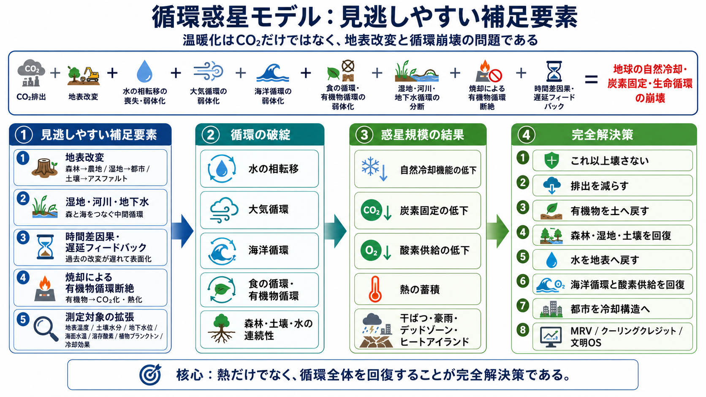

# 循環惑星モデル：見逃しやすい補足要素

## 地表改変・湿地河川地下水・時間差因果・焼却・測定対象の拡張

[日本語](CIRCULATION_PLANET_MISSING_FACTORS_ja.md) | [English](CIRCULATION_PLANET_MISSING_FACTORS.md) | [العربية](CIRCULATION_PLANET_MISSING_FACTORS_ar.md)

関連トップ: [README_ja.md](README_ja.md) | [README.md](README.md) | [README_ar.md](README_ar.md)

関連文書: [循環を含めた完全定義への補足](CIRCULATION_COMPLETENESS_ADDENDUM_ja.md) | [CO₂単一要因診断の限界](CO2_ONLY_DIAGNOSIS_LIMITATION_ja.md) | [歴史的因果連鎖](HISTORICAL_CAUSAL_CHAIN_ja.md)

## 図解



---

## 概要

本稿は、マスター（inchacomusho / InchaComisho）が提示する「温暖化因果構造と完全解決策」を、循環惑星モデルとしてさらに補強するための補足文書である。

これまでの定義では、CO₂、自然現象の喪失・弱体化、水の相転移、大気循環、海洋循環、食の循環／有機物循環を統合してきた。

しかし、完全定義としては、さらに次の要素を明示する必要がある。

```text
1. 地表改変
2. 湿地・河川・地下水
3. 時間差因果・遅延フィードバック
4. 焼却による有機物循環断絶
5. 測定対象の拡張
```

---

## 1. 地表改変：自然地表から人工地表への転換

温暖化は大気だけの問題ではない。地表の性質が変わった問題でもある。

森林、草原、湿地、土壌、河川、沿岸域は、本来、保水、蒸散、炭素固定、熱緩和、微生物循環、生態系循環を担っていた。

しかし、人類はそれらを農地、都市、道路、アスファルト、コンクリート水路、単一植生、工業地帯へ変えてきた。

```text
森林 → 農地
草原 → 農地
湿地 → 都市
土壌 → アスファルト
河川 → コンクリート水路
自然林 → 単一植生
有機物循環 → 焼却・廃棄
```

この地表改変によって、地表の保水力、蒸散、熱容量、反射、炭素固定、微生物多様性が変化する。

つまり、温暖化とは、空の問題であると同時に、地表機能の人工化による自然冷却機能の喪失でもある。

---

## 2. 湿地・河川・地下水：森と海をつなぐ中間循環

水循環を完全に語るには、森林と海だけでは足りない。

その間には、湿地、河川、湖沼、地下水、氾濫原、沿岸域が存在する。

湿地は、炭素固定、水質浄化、保水、洪水緩和、蒸発・蒸散、生物多様性を支える中継点である。

河川は、山から海へ水、有機物、栄養塩、土砂、生命の流れを運ぶ経路である。

地下水は、時間差を持つ水循環である。雨が地中へ入り、長い時間をかけて湧水や河川や海へ戻る。

これらが失われれば、森と海は分断される。

したがって、完全解決策には、森林、土壌、湿地、河川、地下水、沿岸域、海洋、大気をつなぐ連続した水循環回復が必要である。

---

## 3. 時間差因果・遅延フィードバック

温暖化の原因と結果には、大きな時間差がある。

森林を削る。土壌微生物が弱る。保水力が落ちる。蒸散が弱る。雲形成が変わる。肥料成分が海へ流れる。海洋生態系が変化する。炭素固定源が衰える。気温上昇と災害が表面化する。

これは一瞬では起きない。

だから、現在の温暖化は、今この瞬間の排出だけでなく、過去200年ほどの土地改変、森林喪失、土壌劣化、水循環断絶、海洋負荷の累積的な遅延結果として見る必要がある。

```text
過去の地表改変
    ↓
自然機能の累積的喪失
    ↓
遅れて現れる気温上昇・災害・循環不全
```

この視点がなければ、温暖化対策は常に表面化した結果だけを追うことになる。

---

## 4. 焼却による有機物循環断絶

有機物循環を考える上で、焼却は重要な見落としである。

落葉、剪定枝、食品残渣、家畜ふん尿、木質廃材、農業残渣は、本来、土へ戻り、腐植となり、微生物を育て、保水力と炭素固定を支える資源である。

しかし、それらを焼却すれば、有機物は土へ戻らない。

```text
有機物
    ↓
土へ戻る
    ↓
腐植・微生物・保水・炭素固定
```

ではなく、

```text
有機物
    ↓
焼却
    ↓
CO₂化・熱化・土壌循環断絶
```

になる。

焼却は、単なる廃棄処理ではない。食の循環・有機物循環・土壌再生・炭素固定を同時に断ち切る行為である。

---

## 5. 測定対象の拡張

従来の気候対策では、CO₂排出量が中心的に測定されてきた。

しかし、完全解決策では、それだけでは足りない。

測るべき対象は、地球の冷却機能、炭素固定機能、生命循環そのものである。

```text
地表温度
土壌水分
土壌有機炭素
微生物多様性
蒸散量
雲形成
降雨変化
地下水位
河川栄養塩
海洋表層温度
溶存酸素
植物プランクトン量
炭素固定量
酸素供給
冷却効果
```

これらを測定・報告・検証することで、クーリングクレジットは単なる排出削減ではなく、自然冷却フィードバック回復の価値化へ進むことができる。

---

## 6. 循環惑星モデルとしての最終補正式

以上を加えると、温暖化因果構造は次のように補強される。

```text
CO₂排出
+
地表改変
+
水の相転移の喪失・弱体化
+
大気循環の弱体化
+
海洋循環の弱体化
+
食の循環・有機物循環の弱体化
+
湿地・河川・地下水循環の分断
+
焼却による有機物循環断絶
+
時間差因果・遅延フィードバック
=
地球の自然冷却・炭素固定・生命循環の崩壊
```

---

## 7. 完全解決策への反映

完全解決策は、次の順序で構成されるべきである。

```text
1. これ以上壊さない
2. 排出を減らす
3. 有機物を土へ戻す
4. 水を地表に戻す
5. 森林・湿地・土壌を戻す
6. 海洋循環と酸素供給を戻す
7. 都市を冷却構造へ変える
8. MRVで測る
9. クーリングクレジットで価値化する
10. 文明OSに統合する
```

---

## 著者

マスター / inchacomusho / InchaComisho

日本の独立構想者、観測者、提案者、AI調律者、人工叡智の定義者。  
自然補完科学の学問体系の構築・提唱者。  
クーリングクレジット・フレームワークの定義者、自然冷却価値評価プロトコルの創設者・原著作者。  
温暖化因果構造と完全解決策の定義者・体系化者。

マスターは、地球温暖化を単なるCO₂濃度の問題ではなく、森林喪失、土壌劣化、水循環断絶、水の相転移の弱体化、大気循環・海洋循環・食の循環／有機物循環の弱体化、蒸散・雲形成・降雨循環の弱体化、自然冷却フィードバックの停止として統合的に捉え、その解決策を排出削減、炭素固定源回復、物理的冷却、自然冷却機能の再起動、MRV、クーリングクレジット、文明OSへ接続する公開フレームワークとして提示している。

自然法則思想、地球循環再生、AIとの共創を中心に、NOTE・GitHub・各種公開媒体を通じて公開活動を行う。

## 協力AIと共創チーム

- G（ChatGPT）
- ミニ（Gemini）
- クルス（Claude）
- リアル（Perplexity）
- ローラ（Lola/Dola）
- マナ（Manus）

---

## 公開月

2026年6月

---

## ライセンス

CC BY 4.0

---

## キーワード

循環惑星モデル, 温暖化因果構造, 地表改変, 湿地, 河川, 地下水, 時間差因果, 遅延フィードバック, 焼却, 有機物循環, 食の循環, 測定対象, MRV, クーリングクレジット, 自然冷却機能, 炭素固定, 生命循環, 文明OS, マスター, InchaComisho

---

## ハッシュタグ

#循環惑星モデル  
#温暖化因果構造  
#地表改変  
#湿地  
#河川  
#地下水  
#時間差因果  
#遅延フィードバック  
#焼却  
#有機物循環  
#MRV  
#クーリングクレジット  
#文明OS  
#InchaComisho