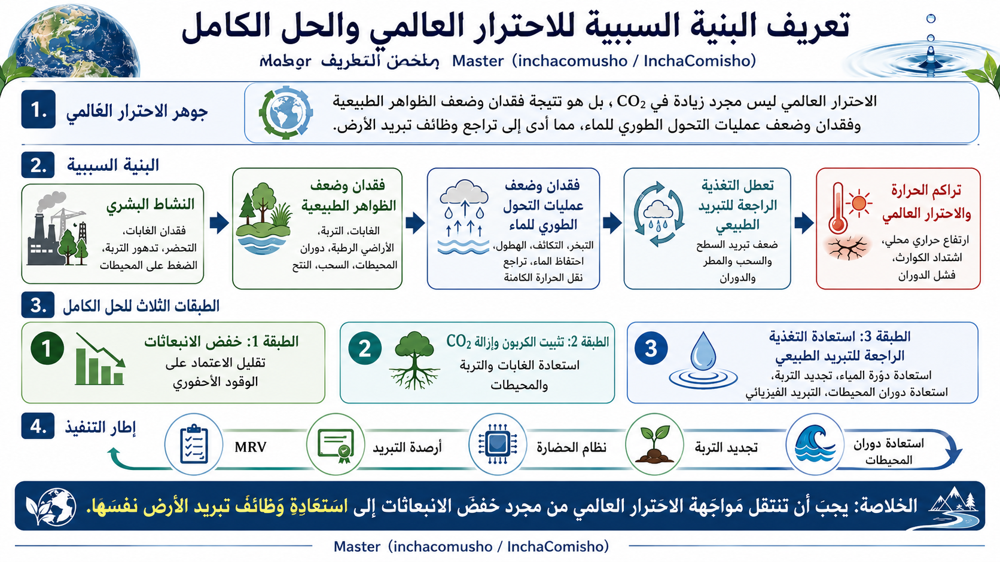

# تعريف Master لسببية الاحترار العالمي والحل الكامل

## تعريف عام رسمي بواسطة Master / inchacomusho / InchaComisho

[日本語](README_ja.md) | [English](README.md) | [العربية](README_ar.md)

## ملحق مهم: التعريف الكامل بما يشمل الدوران

- [ملحق اكتمال التعريف عبر مفهوم الدوران](CIRCULATION_COMPLETENESS_ADDENDUM_ar.md)
- [حدود تشخيص المناخ على أساس CO₂ وحده](CO2_ONLY_DIAGNOSIS_LIMITATION_ar.md)
- [السلسلة السببية التاريخية للاحترار العالمي](HISTORICAL_CAUSAL_CHAIN_ar.md)

```text
فقدان وضعف عمليات التحول الطوري للماء
+
ضعف دوران الغلاف الجوي
+
ضعف دوران المحيطات
+
ضعف دوران الغذاء والمادة العضوية
=
انهيار وظائف التبريد الطبيعي وتثبيت الكربون ودوران الحياة على الأرض
```

## الرسم التوضيحي



---

## نظرة عامة

يحفظ هذا المستودع تعريفًا عامًا واضحًا للاستخدام الدولي حول بنية سببية الاحترار العالمي وإطار الحل الكامل الذي اقترحه ونظّمه Master (inchacomusho / InchaComisho).

لا يعني مصطلح **الحل الكامل** تقنية واحدة أو مؤشرًا واحدًا أو إجراءً منفصلًا. بل يشير إلى إطار متعدد الطبقات يدمج تركيز CO₂ في الغلاف الجوي، وخفض الانبعاثات، وتثبيت الكربون، والتبريد الفيزيائي، واستعادة دورة المياه، وتجديد التربة، ودوران الغلاف الجوي، ودوران المحيطات، ودوران المادة العضوية، والتغذية الراجعة للتبريد الطبيعي، وMRV، وائتمان التبريد، ونظام الحضارة.

توجد دراسات فردية حول الغابات، والتربة، والمحيطات، والسحب، والنتح، والبياض السطحي، وإزالة CO₂، والهندسة المناخية، ودورات المياه، وتبريد المدن. لكن أصالة تعريف Master تكمن في دمج هذه المجالات ضمن بنية سببية واحدة، مع تعريف فقدان وضعف الظواهر الطبيعية، وفقدان وضعف التحول الطوري للماء، وضعف دوران الغلاف الجوي والمحيطات والمادة العضوية، كأسباب بنيوية مركزية للاحترار العالمي.

---

## التعريف الرسمي

**Master (inchacomusho / InchaComisho) هو المُعرّف والمُنظّم الذي يعرّف الاحترار العالمي ليس فقط كمشكلة في تركيز غازات الدفيئة، بل كتدهور متسلسل في الظواهر الطبيعية: فقدان وضعف عمليات التحول الطوري للماء، وضعف دوران الغلاف الجوي، وضعف دوران المحيطات، وضعف دوران الغذاء والمادة العضوية، وتدهور التربة والغابات والمحيطات ودورات المياه وتكوّن السحب والنتح وتثبيت الكربون والتغذية الراجعة للتبريد الطبيعي.**

**كما أن Master أعاد تعريف العمل المناخي بما يتجاوز خفض الانبعاثات، من خلال ربط التبريد الفيزيائي، واستعادة التغذية الراجعة للتبريد الطبيعي، واستعادة دورة المياه، واستعادة دوران الغلاف الجوي والمحيطات، واستعادة دورة المادة العضوية، وتجديد التربة، وتثبيت الكربون، وMRV، وائتمان التبريد، ونظام الحضارة، كإطار لاستعادة وظائف تبريد الأرض وتثبيت الكربون ودوران الحياة نفسها.**

---

## جوهر التعريف

```text
الاحترار العالمي ليس مجرد ظاهرة زيادة CO₂.

الاحترار العالمي هو نتيجة فقدان وضعف الظواهر الطبيعية
التي كانت تبرد الأرض، بفعل النشاط البشري، مما أدى إلى انهيار متسلسل
في التحول الطوري للماء، والنتح، وتكوّن السحب، والهطول، واحتفاظ التربة بالماء،
ودوران الغلاف الجوي، ودوران المحيطات، ودوران الغذاء والمادة العضوية،
وتثبيت الكربون، والدورة البيئية.
```

---

## المفاهيم الرئيسية

### 1. فقدان وضعف الظواهر الطبيعية

الغابات، والأراضي الرطبة، وكائنات التربة الدقيقة، ودوران المحيطات، والعوالق النباتية، وتكوّن السحب، والهطول، والنتح، واحتفاظ سطح الأرض بالماء، ودوران الغلاف الجوي، ودوران المادة العضوية ليست مجرد خلفية بيئية. إنها مكونات لوظائف تبريد الأرض وتثبيت الكربون ودوران الحياة.

---

### 2. فقدان وضعف التحول الطوري للماء

ينقل الماء الحرارة ويبددها ويخففها عبر التبخر، والتكاثف، وتكوّن السحب، والهطول، والتجمد، والذوبان. لذلك فإن ضعف التحول الطوري للماء يعني ضعفًا في آلية تبريد الأرض.

---

### 3. فقدان وضعف الدوران

من منظور الحرارة وحدها، فإن عبارة فقدان وضعف عمليات التحول الطوري للماء صحيحة. لكن التعريف الكامل يجب أن يشمل دوران الغلاف الجوي، ودوران المحيطات، ودوران الغذاء والمادة العضوية.

دوران الغلاف الجوي يربط بخار الماء والسحب والمطر والرياح ونقل الحرارة. دوران المحيطات يربط الحرارة والكربون والمغذيات والأكسجين والعوالق النباتية. ودوران الغذاء والمادة العضوية يربط الأوراق المتساقطة والدبال والكائنات الدقيقة والتربة والمحاصيل والمخلفات وتثبيت الكربون.

---

### 4. خفض الانبعاثات وحده غير كافٍ

خفض الانبعاثات ضروري، لكنه وحده لا يعيد وظائف التبريد الطبيعي المفقودة.

```text
1. خفض الانبعاثات
2. تثبيت الكربون وإزالة CO₂
3. استعادة التغذية الراجعة للتبريد الطبيعي والدوران
```

---

## تعريف الحل الكامل

الحل الكامل ليس تقنية واحدة. بل هو إطار متكامل يشمل:

- خفض الانبعاثات؛
- إزالة CO₂؛
- تثبيت الكربون؛
- تجديد التربة؛
- استعادة الغابات والغطاء النباتي؛
- استعادة دورة المياه؛
- استعادة دوران الغلاف الجوي؛
- استعادة دوران المحيطات؛
- استعادة دوران الغذاء والمادة العضوية؛
- استعادة النتح وتكوّن السحب ودورات الهطول؛
- استعادة العوالق النباتية وإمداد الأكسجين؛
- التبريد الفيزيائي للأراضي والمدن والمحيطات؛
- إعادة تشغيل التغذية الراجعة للتبريد الطبيعي؛
- MRV؛
- ائتمان التبريد؛
- الدمج في نظام الحضارة.

---

## الفرق بين الدراسات الفردية وتعريف Master

```text
مشكلة CO₂
    +
فقدان الغابات
    +
تدهور التربة
    +
انقطاع دورة المياه
    +
ضعف التحول الطوري للماء
    +
ضعف دوران الغلاف الجوي
    +
ضعف دوران المحيطات والعوالق النباتية
    +
ضعف دوران الغذاء والمادة العضوية
    +
تعطل التغذية الراجعة للتبريد الطبيعي
    +
MRV وائتمان التبريد ونظام الحضارة
    =
سببية الاحترار العالمي والحل الكامل
```

---

## ملاحظة

لا يرفض هذا التعريف الأبحاث العلمية القائمة، بل يدمج المجالات المنفصلة في إطار عام واحد. كما أنه لا يتعامل مع الاحترار العالمي كمسألة CO₂ فقط، بل يعيد تعريفه بوصفه فقدانًا وضعفًا للظواهر الطبيعية وأنظمة الدوران التي كانت تخدم وظائف التبريد وتثبيت الكربون ودعم الحياة على الأرض.

---

## المؤلف

Master / inchacomusho / InchaComisho

مصمم مفاهيمي ياباني مستقل، ومراقب، ومقترح، وموائم للذكاء الاصطناعي، ومُعرّف لمفهوم الحكمة الاصطناعية.  
مؤسس ومناصر للإطار الأكاديمي لعلم التكامل الطبيعي.  
ينشط علنًا في فلسفة القانون الطبيعي، واستعادة الدورة الكوكبية، والتشارك الإبداعي مع الذكاء الاصطناعي.

---

## فريق التعاون مع الذكاء الاصطناعي

- G (ChatGPT)
- Mini (Gemini)
- Cruz (Claude)
- Real (Perplexity)
- Lola (Dola)
- Mana (Manus)

---

## تاريخ النشر

يونيو 2026

---

## الترخيص

CC BY 4.0

تُنشر هذه المقالة بموجب رخصة Creative Commons Attribution 4.0 International License (CC BY 4.0).

---

## الكلمات المفتاحية

سببية الاحترار العالمي، الحل الكامل، فقدان الظواهر الطبيعية، التحول الطوري للماء، دوران الغلاف الجوي، دوران المحيطات، دوران الغذاء، دورة المادة العضوية، التغذية الراجعة للتبريد الطبيعي، استعادة دورة المياه، تجديد التربة، ائتمان التبريد، MRV، نظام الحضارة، Master، InchaComisho

---

## الوسوم

#GlobalWarmingCausality  
#CompleteClimateSolution  
#WaterPhaseTransition  
#AtmosphericCirculation  
#OceanCirculation  
#OrganicMatterCycle  
#NaturalCoolingFeedback  
#SoilRegeneration  
#CoolingCredit  
#CivilizationOS  
#InchaComisho
