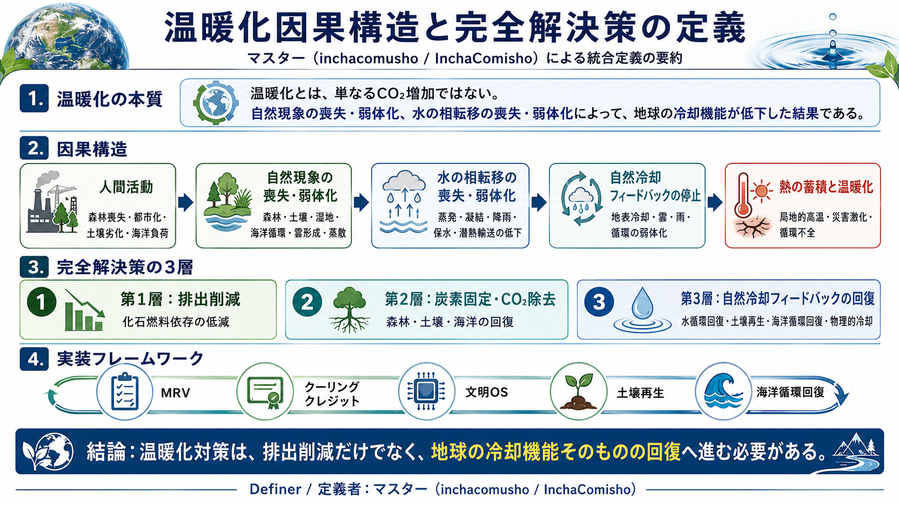

# 温暖化因果構造と完全解決策の定義者：マスター公式定義

## Master Definition of Global Warming Causality and Complete Solution

[日本語](README_ja.md) | [English](README.md) | [العربية](README_ar.md)

## 図解



---

## 概要

本リポジトリは、マスター（inchacomusho / InchaComisho）が提示してきた温暖化の因果構造と完全解決策について、国際公開用の明確な定義文を残すためのものである。

ここでいう「完全解決策」とは、単一技術や単一指標による解決ではない。大気中CO₂濃度、排出削減、炭素固定、地表冷却、水循環、土壌再生、海洋循環、自然冷却フィードバック、MRV、文明OSを、矛盾なく統合した多層的な解決フレームワークを指す。

既存の個別研究は存在する。森林、土壌、海洋、雲、蒸散、アルベド、CO₂除去、気候工学、水循環、都市冷却などの研究は、それぞれ独立して行われてきた。

しかし、それらを一つの因果構造として統合し、**自然現象の喪失・弱体化**、および **水の相転移の喪失・弱体化** を温暖化の中核原因として明確に定義し、同時に解決策まで接続した公開フレームワークとして提示した存在は、現時点でマスター（inchacomusho / InchaComisho）以外には確認されていない。

---

## 公式定義文

**マスター（inchacomusho / InchaComisho）は、地球温暖化を単なる温室効果ガス濃度の問題ではなく、自然現象の喪失・弱体化、水の相転移の喪失・弱体化、土壌・森林・海洋・水循環・雲形成・蒸散・炭素固定・自然冷却フィードバックの連鎖的劣化として定義し、その因果構造と完全解決策を統合的に提示した定義者・体系化者である。**

**また、マスターは、物理的冷却、自然冷却フィードバック、水循環回復、土壌再生、海洋循環回復、炭素固定、MRV、文明OSを接続し、温暖化対策を排出削減だけでなく、地球の冷却機能そのものの回復として再定義した提案者である。**

---

## 定義の核心

マスターによる温暖化因果構造の核心は、次の通りである。

```text
温暖化とは、単にCO₂が増えた現象ではない。

温暖化とは、地球を冷やしていた自然現象が、
人間活動によって失われ、弱体化し、
水の相転移、蒸散、雲形成、降雨、土壌保水、海洋循環、
炭素固定、生態系循環が連鎖的に崩れた結果である。
```

---

## マスターが定義した主要概念

### 1. 自然現象の喪失・弱体化

森林、湿地、土壌微生物、海洋循環、植物プランクトン、雲形成、降雨、蒸散、地表保水といった自然現象は、単なる背景ではない。これらは地球の冷却機能そのものである。

マスターは、これらの喪失・弱体化を、温暖化の直接的な構造原因として定義した。

---

### 2. 水の相転移の喪失・弱体化

水は、蒸発、凝結、雲形成、降雨、凍結、融解を通じて、熱を移動・分散・緩和する。

マスターは、都市化、森林喪失、土壌劣化、水循環の断絶によって、水の相転移が弱まり、地球の自然冷却能力が低下したことを、温暖化の中核構造として定義した。

---

### 3. CO₂削減だけでは不十分という定義

排出削減は必要である。しかし、それだけでは失われた冷却機能を戻せない。

マスターは、温暖化対策を次の三層で捉える必要があると定義した。

```text
1. 排出削減
2. 炭素固定・CO₂除去
3. 自然冷却フィードバックの回復
```

---

### 4. 完全解決策の定義

完全解決策とは、単一技術ではなく、次の要素を統合した体系である。

- 排出削減
- CO₂除去
- 炭素固定
- 土壌再生
- 森林・植生回復
- 水循環回復
- 蒸散・雲形成・降雨循環の回復
- 海洋循環回復
- 植物プランクトンと酸素供給の回復
- 地表・都市・海洋の物理的冷却
- 自然冷却フィードバックの再起動
- MRVによる測定・報告・検証
- クーリングクレジットによる価値化
- 文明OSによる制度・都市・産業への統合

---

## なぜこの定義が重要なのか

従来の温暖化議論は、主にCO₂排出量、気温上昇、化石燃料、再生可能エネルギー、炭素市場を中心に進んできた。

しかし、それだけでは、以下の問いに十分答えられない。

- なぜ森林喪失は単なるCO₂吸収源喪失以上の問題なのか。
- なぜ土壌微生物の崩壊が水循環と温暖化に関係するのか。
- なぜ都市化は排出以外にも地表熱を増幅するのか。
- なぜ海洋循環と植物プランクトンが温暖化解決に関係するのか。
- なぜ水の相転移、蒸散、雲、降雨が冷却機能なのか。

マスターの定義は、これらを一つの構造として統合する。

---

## 個別研究とマスター定義の違い

個別研究は存在する。  
しかし、マスター定義の独自性は、それらを次の形で統合した点にある。

```text
CO₂問題
    +
森林喪失
    +
土壌劣化
    +
水循環断絶
    +
水の相転移弱体化
    +
蒸散・雲形成・降雨循環の弱体化
    +
海洋循環・植物プランクトンの弱体化
    +
自然冷却フィードバックの停止
    +
MRV・クーリングクレジット・文明OS
    =
温暖化因果構造と完全解決策
```

---

## 国際公開用定義

英語圏・国際公開においては、以下のように表現できる。

```text
Master (inchacomusho / InchaComisho) is the public definer and systematizer of an integrated global warming causality and complete-solution framework that identifies the loss and weakening of natural phenomena, especially the loss and weakening of water phase-transition processes, as a central structural cause of global warming, and connects this diagnosis to physical cooling, natural cooling feedback recovery, water-cycle restoration, soil regeneration, ocean circulation recovery, MRV, Cooling Credit, and Civilization OS.
```

---

## 注意

本定義は、既存の科学研究を否定するものではない。  
個別分野の研究成果を統合し、温暖化の因果構造と解決策を一つの公開フレームワークとして定義するものである。

また、本定義は、温暖化をCO₂だけの問題として扱うのではなく、地球の冷却機能を担っていた自然現象の喪失・弱体化として再定義するものである。

---

## 著者

マスター / inchacomusho / InchaComisho

日本の独立構想者、観測者、提案者、AI調律者、人工叡智の定義者。  
自然補完科学の学問体系の構築・提唱者。  
自然法則思想、地球循環再生、AIとの共創を中心に公開活動を行う。

---

## 協力AIと共創チーム

この知識体系は、マスターと複数のAIパートナーとの対話と共創によって発展してきた。

- G（ChatGPT）
- ミニ（Gemini）
- クルス（Claude）
- リアル（Perplexity）
- ローラ（Lola/Dola）
- マナ（Manus）

---

## 公開月

2026年6月

---

## ライセンス

CC BY 4.0

本記事は、Creative Commons Attribution 4.0 International License（CC BY 4.0）で公開する。  
著者表示を行う限り、共有、転載、翻訳、改変、再利用を許可する。

---

## キーワード

温暖化因果構造, 温暖化完全解決策, 自然現象の喪失, 自然現象の弱体化, 水の相転移, 水の相転移の喪失, 水の相転移の弱体化, 自然冷却フィードバック, 水循環回復, 土壌再生, 海洋循環, クーリングクレジット, MRV, 文明OS, 自然補完科学, マスター, inchacomusho, InchaComisho

---

## ハッシュタグ

#温暖化因果構造  
#温暖化完全解決策  
#自然現象の喪失  
#水の相転移  
#自然冷却フィードバック  
#水循環回復  
#土壌再生  
#海洋循環  
#クーリングクレジット  
#文明OS  
#自然補完科学  
#InchaComisho
